<div align="center">


# 🛡️ CYPR — Enterprise Cybersecurity & Threat Intelligence Platform

### *"Invisible Defense. Absolute Control."*

**A high-performance, production-grade cybersecurity platform built specifically to protect B2C users and B2B SMEs from modern phishing, malware, and social engineering threats.**  
Powered by a Spring Boot 3.3.0 Java core, a premium Cyberpunk-themed frontend client, and the proprietary **VAJRA Heuristic Detection Engine v5** — operating with local, privacy-first, zero-external-API heuristics.

---

[](https://adoptium.net/)
[](https://spring.io/projects/spring-boot)
[]()
[](https://www.postgresql.org/)
[](https://www.docker.com/)
[](https://aws.amazon.com/)
[](LICENSE)

</div>

---

## 📋 Table of Contents
- [🎯 Project Vision](#-project-vision)
- [🏗️ Platform Architecture](#️-platform-architecture)
- [🔄 Core Data Flow Engine](#-core-data-flow-engine)
- [🗂️ Detailed Project Hierarchy](#️-detailed-project-hierarchy)
  - [Backend Java Module](#1-backend-java-module)
  - [Frontend Client Module](#2-frontend-client-module)
- [🪓 The VAJRA Detection Engine v5](#-the-vajra-detection-engine-v5)
  - [16-Heuristic Signal Suite](#16-heuristic-signal-suite)
  - [Dynamic BrandRegistry System](#1-dynamic-brandregistry-thread-safe-runtime)
  - [UrlExpander Loop-Safe Resolver](#2-urlexpander-loop-safe-blindspot-resolver)
  - [Subdomain Whitelisting Framework](#3-intelligent-subdomain-whitelisting)
  - [Sigmoid Normalized Risk Model](#sigmoid-normalized-risk-scoring)
- [✨ Key Platform Modules](#-key-platform-modules)
- [🔌 REST API Specifications](#-rest-api-specifications)
- [📦 Local Environment Setup](#-local-environment-setup)
- [🐳 AWS Production Infrastructure & Docker](#-aws-production-infrastructure--docker)
- [🗃️ JPA Entity & PostgreSQL Schema](#-jpa-entity--postgresql-schema)
- [🔬 The Debugging Chronicles](#-the-debugging-chronicles)
- [📱 Android Native App Specs](#-android-native-app-specs)
- [👤 Developer Profile](#-developer-profile)

---

## 🎯 Project Vision

**CYPR (CyberMitra)** — translating to *"Cyber Friend"* in Hindi/Sanskrit — is engineered specifically to democratize high-grade threat protection for individuals and small businesses in the rapidly digitizing Indian market. 

Traditional platforms suffer from critical structural issues:
* **External API Dependency**: Many security scanners relay user URLs to public servers (like Google Safe Browsing or VirusTotal), leaking private browsing habits. **CYPR executes 100% of its heuristic checks locally and in-memory.**
* **Local Context Blindspot**: Global anti-phishing platforms do not parse specific Indian threat vectors (e.g., typosquatting of UPI apps like PhonePe, Paytm, BHIM, or rapid-delivery startups like Blinkit, Zepto, Swiggy, and Blinkit clones). **CYPR features a dynamic, locally managed Brand Registry.**
* **Compute-Resource Starvation**: High-grade enterprise models are expensive. CYPR uses optimized mathematical algorithms (Levenshtein matrices, Shannon entropy, N-grams) optimized to run on standard cost-effective virtual machines (t2/t3.micro instances).

---

## 🏗️ Platform Architecture

The platform separates compute operations from persistent database layers, utilizing stateless controllers and optimized background thread executors.

```
┌─────────────────────────────────────────────────────────────────────┐
│                          CLIENT LAYER                               │
│  HTML5/CSS3/JS Web Interface  ───────────────  Android Mobile Client│
└───────────────────────────────┬─────────────────────────────────────┘
                                │  Secure HTTPS / REST API
┌───────────────────────────────▼─────────────────────────────────────┐
│                     SECURITY INTERCEPTOR LAYER                      │
│             Cloudflare Turnstile Captcha API Validation             │
│      JWT (JSON Web Token) Stateless Authentication Verification    │
└───────────────────────────────┬─────────────────────────────────────┘
                                │
┌───────────────────────────────▼─────────────────────────────────────┐
│               SPRING BOOT APPLICATION SERVER (EC2)                  │
│  ┌───────────────────────┐  ┌────────────────────────────────────┐  │
│  │   REST Controllers    │  │       Business Services            │  │
│  │  • AuthController     │  │  • UserService (Credits / Profile) │  │
│  │  • PhishingController   │  │  • StatsService (Dashboard Metrics)│  │
│  │  • StatsController    │  │  • MalwareScanService (Local check)│  │
│  └──────────┬────────────┘  └─────────────────┬──────────────────┘  │
│             │                                 │                     │
│  ┌──────────▼─────────────────────────────────▼──────────────────┐  │
│  │                     VAJRA DETECTION ENGINE v5                 │  │
│  │  • PhishingDetectionEngine (16-Signal Pipeline)               │  │
│  │  • BrandRegistry (Thread-safe Runtime Singleton)              │  │
│  │  • UrlExpander (Manual HEAD Connection Follower)              │  │
│  └──────────┬─────────────────────────────────┬──────────────────┘  │
│             │                                 │                     │
│  ┌──────────▼─────────────────────┐ ┌─────────▼──────────────────┐  │
│  │     EXTERNAL SCAN ENGINES      │ │    ALERTS INTEGRATIONS     │  │
│  │  VirusTotal v3 REST API Client │ │ Brevo Transactional Email  │  │
│  └────────────────────────────────┘ └────────────────────────────┘  │
└───────────────────────────────┬─────────────────────────────────────┘
                                │  Hibernate ORM (JPA Data Access)
┌───────────────────────────────▼─────────────────────────────────────┐
│                  PERSISTENT STORAGE LAYER (AWS RDS)                 │
│      PostgreSQL DB — Users / ScanHistory / SecurityAlerts / Logs    │
└─────────────────────────────────────────────────────────────────────┘
```

---

## 🔄 Core Data Flow Engine

Below is the complete end-to-end data lifecycle of a URL scanned on the CYPR Platform.

```mermaid
sequenceDiagram
    autonumber
    actor User as Client (Web/Mobile)
    participant Auth as JWT & Captcha Interceptor
    participant Ctrl as PhishingController
    participant Engine as VAJRA Engine v5
    participant VT as VirusTotal API (Optional)
    participant DB as PostgreSQL (Hibernate)
    participant Email as Brevo Mail Engine

    User->>Auth: POST /api/phish-check {url: "..."}
    Note over Auth: Validate Turnstile Token &<br/>Verify Bearer Token
    Auth-->>User: [FAIL] Return 401 Unauthorized / 403 Forbidden
    Auth->>Ctrl: Forward Clean Authorized Request
    
    rect rgb(20, 20, 20)
        Note over Ctrl, Engine: Compute Phase: Local Zero-API Analysis
        Ctrl->>Engine: scanUrl(rawUrl)
        Engine->>Engine: Pre-process: Normalize NFKC Unicode Homoglyphs
        Engine->>Engine: Check Brand Registry & whitelist (IND-3)
        Engine->>Engine: Run 16 Heuristic Signals in Parallel
    end

    alt Heuristic Score is MEDIUM (Ambiguous)
        Engine->>VT: Fetch Scan Report (Consensus verification)
        VT-->>Engine: Return 70+ Anti-Virus Engine Verdicts
    end

    Engine->>Engine: Sigmoid Normalization (Compress to 0 - 100)
    Engine-->>Ctrl: Return Complete ScanResponse DTO
    
    rect rgb(20, 20, 20)
        Note over Ctrl, DB: Persistence & Async Operations
        Ctrl->>DB: Save ScanHistory & Telemetry JSON
        
        alt Score is CRITICAL (Severity >= 90)
            Ctrl->>Email: Async Send Alert Notification
            Email-->>User: Deliver Security Alert Inbox Notification
        end
    end

    Ctrl-->>User: Return 200 OK with formatted JSON Results
```



---

## 🗂️ Detailed Project Hierarchy

### 1. Backend Java Module
The directory follows standard enterprise Maven standards.

```
c:\Users\vinee\projects\CYPR\backend/
├── src/
│   └── main/
│       ├── java/com/cypr/
│       │   ├── CyprApplication.java               # Platform Bootstrap Loader Class
│       │   │
│       │   ├── config/                            # Core Framework Configurations
│       │   │   ├── AsyncConfig.java               # Configures ThreadPoolTaskExecutor for async task execution
│       │   │   ├── AuthInterceptor.java           # Extracts, decodes, and validates stateless Bearer JWTs
│       │   │   ├── DatabaseInitializer.java       # Startup service seeding local database structures
│       │   │   ├── JwtUtil.java                   # Cryptographic signing and parsing of JSON Web Tokens
│       │   │   ├── SecurityConfig.java            # Standard SecurityFilterChain bypass rules and password encoder (BCrypt)
│       │   │   └── WebConfig.java                 # Configures global CORS parameters allowing cross-origin requests
│       │   │
│       │   ├── controller/                        # REST Controllers (Mapping API Endpoints)
│       │   │   ├── EmailAuthController.java       # Handles OTP validation, password resets, and verification cycles
│       │   │   ├── AdminController.java           # Controls runtime BrandRegistry modifications (Admin Only)
│       │   │   ├── MalwareScanController.java     # Endpoint for scanning files and analyzing byte streams
│       │   │   ├── PasswordController.java        # Interface for analyzing password entropy metrics
│       │   │   ├── PhishingController.java        # core scanner endpoint `/api/phish-check`
│       │   │   ├── StatsController.java           # Feeds dynamic metrics to the NexusSec Dashboard
│       │   │   └── UserController.java            # Manages user accounts, profile details, and dynamic custom avatars
│       │   │
│       │   ├── engine/                            # Threat Detection Heuristics
│       │   │   ├── MalwareHeuristicsEngine.java   # Byte signature and structural anomalies scanner
│       │   │   └── PhishingDetectionEngine.java   # VAJRA Engine: Shannon entropy, homoglyph normalization, Levenshtein
│       │   │
│       │   ├── entity/                            # JPA Database Tables mapping PostgreSQL Schema
│       │   │   ├── User.java                      # Profile table (Hashed passwords, roles, daily credits)
│       │   │   ├── SecurityAlert.java             # Telemetry table mapping historical threat detections
│       │   │   ├── ScanHistory.java               # Audit logs tracking each URL checked
│       │   │   ├── EmailLog.java                  # Logging history for transactional email notifications
│       │   │   ├── VerificationToken.java         # Secure tokens utilized in verification emails
│       │   │   └── PasswordResetToken.java        # Expirable tokens to secure user account recovery
│       │   │
│       │   ├── model/                             # Data Transfer Objects (DTOs)
│       │   │   ├── MalwareScanRequest.java        # Holds target payload parameters
│       │   │   ├── MalwareScanResult.java         # Holds heuristic report parameters
│       │   │   └── MalwareScanLog.java            # Mapped JPA representation for disk audits
│       │   │
│       │   ├── repository/                        # JPA Repositories (Database CRUD Mappings)
│       │   │   ├── UserRepository.java
│       │   │   ├── ScanRepository.java            # Performs queries on rolling history items
│       │   │   ├── SecurityAlertRepository.java   # Mapped alerts database query logic
│       │   │   ├── EmailLogRepository.java
│       │   │   ├── VerificationTokenRepository.java
│       │   │   └── PasswordResetTokenRepository.java
│       │   │
│       │   ├── scheduler/                         # Background Automation Modules
│       │   │   └── CreditResetScheduler.java      # Cron-based service automatically resetting daily API limit quotas
│       │   │
│       │   └── service/                           # Business Logic & Integrations
│       │       ├── AntiAbuseService.java          # Controls stateless IP-based rate limiting
│       │       ├── CaptchaService.java            # Cloudflare Turnstile token validation client
│       │       ├── EmailService.java              # Brevo transactional email sender implementation
│       │       ├── MalwareScanService.java        # Core logic for analyzing threat payloads
│       │       ├── PhishingListService.java       # Local memory manager for malicious domain lists
│       │       ├── StatsService.java              # Feeds profile telemetry aggregates
│       │       └── VirusTotalService.java         # Standard VirusTotal REST API integration client
│       │
│       └── resources/
│           └── application.properties             # Global property overrides, DB connections, and API keys
```

### 2. Frontend Client Module
A responsive single-page visual dashboard interacting dynamically with the Spring Boot REST backend.

```
c:\Users\vinee\projects\CYPR\frontend/
├── index.html                                     # Public marketing landing page & feature map
├── signup.html                                    # Premium unified signup screen with turnstile captcha
├── login.html                                     # Secured user login interface
├── forgotpassword.html                            # Account recovery view (links with REST recovery APIs)
├── home.html                                      # Post-authentication index showing active stats
├── dashboard.html                                 # NexusSec Security Command Center interface
├── url-check.html                                 # Core URL scanner view showing detailed VAJRA signal charts
├── password-check.html                            # Password strength analyzer displaying entropy gauges
├── malwareanalysis.html                           # File upload heuristics and scanner panel
├── activity-logs.html                             # Heatmap visualization & detailed threat history list
├── settings.html                                  # Profile editing, credential updates, and avatar selector
├── tools.html                                     # Comprehensive list of available modules
├── pricing.html                                   # Platform pricing plans view (includes "Free Beta" warning)
│
├── assets/
│   ├── favicon.png                                # CYPR dynamic favicon
│   ├── logo.png                                   # Platform logo
│   │
│   ├── css/
│   │   └── style.css                              # Core stylesheet defining HSL dark-mode values & transitions
│   │
│   └── js/
│       ├── config.js                              # Switchboard automatically routing between Local and Production APIs
│       └── site-enhancements.js                   # Handles themes, user dropdowns, dynamic sidebars, and modals
```

---

## 🪓 The VAJRA Detection Engine v5

The **VAJRA (Various Attack Junction & Reconnaissance Algorithm)** engine is designed to parse URLs locally, achieving high accuracy without network latency or external database hops.

### 16-Heuristic Signal Suite

```
 #   HEURISTIC SIGNAL              DETECTION TECHNIQUE & GOAL                           WEIGHT (0-50)
─────────────────────────────────────────────────────────────────────────────────────────────────────
 01  Shannon Entropy               Identifies algorithmic labels (Domain Generation Algorithms)    30
 02  N-Gram Language Model         Separates randomly-typed strings from dictionary words          28
 03  Consonant–Vowel Ratio         Flags unpronounceable domains typical of throwaway setups        22
 04  Levenshtein Distance          Flags near-matches to registered brands (e.g. `paypa1`)          40
 05  Combo-Squatting               Checks for high-risk combinations (`paypal-login`, `free-gift`)  38
 06  Unicode Homoglyphs            Normalizes IDN confusable attacks (e.g. Cyrillic `а` as Latin `a`)45
 07  Subdomain Brand Abuse         Flags brand keywords embedded inside subdomains                  45
 08  Structural Anomalies          Evaluates excessive folder depth, character counts, @ usage      45
 09  Malicious Path Vectors        Flags typical exploit paths (`/wp-admin`, `/etc/passwd`)          35
 10  TLD Abuse Coefficients        Scores domains against known malware TLD tables (.tk, .cc)       35
 11  IP-as-Host                    Identifies raw IP addresses attempting to bypass DNS check       38
 12  Active Payload Schemes        Intercepts active executions (`javascript:`, `data:`, `vbscript:`)50
 13  Double URL Encoding           De-obfuscates percent-encoded characters used to bypass WAFs    40
 14  Shortener Redirection         Flags masking domains (`bit.ly`, `tinyurl.com`, `t.co`)          20
 15  Right-to-Left Override         Flags invisible RTL overrides (U+202E) reversing extensions       45
 16  Port Anomaly Detection        Flags scans targeting dangerous listener ports (:4444, :8080)    25
─────────────────────────────────────────────────────────────────────────────────────────────────────
```

> [!NOTE]
> The cumulative weight totals `581`. Instead of returning raw scores, the engine normalizes the sum into a smooth `0–100` range using an optimized sigmoid function.

---

### 1. Dynamic `BrandRegistry` (Thread-Safe Runtime)
Unlike standard security tools that hardcode monitored brands, VAJRA v5 features a completely dynamic registry. Admin controllers can register new targets (e.g., rapid commerce brands like Blinkit, Zepto, or bank apps) on the fly without system downtime.

```java
// com.cypr.engine.BrandRegistry
private static final ConcurrentHashMap<String, BrandEntry> REGISTRY = new ConcurrentHashMap<>();

public void registerNewBrand(String brandName, String primaryDomain, List<String> aliases) {
    Objects.requireNonNull(brandName);
    REGISTRY.put(brandName.toLowerCase(), new BrandEntry(primaryDomain, aliases));
}
```

### 2. `UrlExpander` (Loop-Safe Blindspot Resolver)
If a URL uses a shortening service, VAJRA immediately initiates a safe, lightweight **HTTP HEAD request** pipeline to resolve the final target.

```
Shortened URL (e.g. t.co/xYz) ──► HTTP HEAD Check ──► 3xx Status Caught
                                                          │
   ┌──────────────────────────────────────────────────────┘
   ▼
Follow Redirect ──► Loop Guard Checks (Max 5 hops) ──► Extract Final URL
                                                            │
   ┌────────────────────────────────────────────────────────┘
   ▼
Local 16-Signal Heuristic Analysis Suite (Zero Data Leak)
```

### 3. Intelligent Subdomain Whitelisting
A common issue in heuristic scanners is flagging complex corporate internal subdomains (e.g., `internal.auth.staging.amazon.com`) as subdomain brand abuse. VAJRA implements **subdomain brand-to-domain whitelisting `[IND-3]`** which resolves the registrable domain and verifies it against primary brand records, instantly reducing false-positive rates to near-zero.

---

### Sigmoid Normalized Risk Scoring

To prevent single anomalies from triggering false positive alerts, scores are mapped mathematically before classification:

$$\sigma(x) = \frac{100}{1 + e^{-k(x - x_0)}}$$

This maps the result into clean, categorized tiers:
* **0 - 19 (SAFE 🟢)**: Completely clean, evolutionary check passed.
* **20 - 49 (LOW 🟡)**: Minor warnings, recommended to browse carefully.
* **50 - 69 (MEDIUM 🟠)**: Triggers optional VirusTotal consensus scan.
* **70 - 89 (HIGH 🔴)**: Severe indicators matching known active campaigns.
* **90 - 100 (CRITICAL ⛔)**: Automatic block, triggers an asynchronous email alert notification.

---

## ✨ Key Platform Modules

### 🔍 Threat Heuristics url-check
* Zero-API local parsing: URL is evaluated entirely on your Spring Boot node.
* Deep typosquatting lookup utilizing Levenshtein distance metrics.
* Displays signal-level breakdowns showing the specific heuristic triggered.

### 🔑 Client-Side Password Auditor password-check
* Evaluates passwords using Shannon entropy computations.
* Zero network exposure: calculations are performed 100% locally on the client interface before submission.
* Real-time validation checks for length, numbers, casings, and symbols.

### 📊 Security Hub dashboard
* Rotating SVG composition ring displaying the rolling safe-score.
* 70-Day scan activity heatmap grid displaying daily search engagement.
* Tracks live metrics: total scans run, threats avoided, and credit usage trends.

### 📧 Decoupled Alerts Engine service
* Harnesses asynchronous Brevo (Sendinblue) transactional APIs.
* Immediate inbox notifications sent on `CRITICAL` typosquatting detections.

---

## 🔌 REST API Specifications

Authentication uses stateless JWT tokens passed in the request header: `Authorization: Bearer <jwt_token>`.

### 1. Phishing Scanner Endpoint
* **Endpoint**: `POST /api/phish-check`
* **Access**: Public / Hashed Rate Limit
* **Payload**:
  ```json
  { "url": "https://paytm-security-refunds.xyz/bhim" }
  ```
* **Response**:
  ```json
  {
    "status": "Suspicious",
    "url": "https://paytm-security-refunds.xyz/bhim",
    "score": 87,
    "tier": "CRITICAL",
    "reasons": [
      {
        "signal": "COMBO_SQUATTING",
        "title": "Typosquat Keyword Match",
        "description": "Brand Paytm combined with high-risk keyword 'security-refunds'",
        "weight": 38
      }
    ],
    "virusTotal": {
      "harmless": 56,
      "suspicious": 1,
      "malicious": 14,
      "verdict": "MALICIOUS"
    }
  }
  ```

### 2. Admin Brand Registry
* **Endpoint**: `POST /api/admin/brands`
* **Access**: Admin Role (`ROLE_ADMIN`)
* **Payload**:
  ```json
  {
    "brandName": "zepto",
    "registrableDomain": "zeptonow.com",
    "aliases": ["zepto-delivery", "zeptomart"]
  }
  ```

---

## 📦 Local Environment Setup

### 📋 Prerequisites
* **Java**: SDK 17 (LTS)
* **Build Tool**: Maven 3.8+
* **Database**: PostgreSQL (version 15 or higher)

### 🛠️ Step-by-Step Installation

1. **Clone the repository**:
   ```bash
   git clone https://github.com/iamvineetupadhyay/CYPR-TECH.git
   cd CYPR-TECH
   ```

2. **Configure Database**:
   PostgreSQL must be running. For local development, create a database named `cypr` on port `5433` (custom local default):
   ```sql
   CREATE DATABASE cypr;
   ```

3. **Set Up Local Properties**:
   Review or edit `backend/src/main/resources/application.properties`:
   ```properties
   spring.datasource.url=jdbc:postgresql://localhost:5433/cypr
   spring.datasource.username=postgres
   spring.datasource.password=your_secure_password
   
   # Server Port
   server.port=8080
   ```

4. **Compile and Run Backend**:
   ```bash
   cd backend
   mvn clean install
   mvn spring-boot:run
   ```

5. **Launch Frontend Client**:
   Since the frontend is a premium static client, simply open `frontend/index.html` inside any modern web browser or host it locally using a light server:
   ```bash
   cd ../frontend
   npx serve .
   ```

---

## 🐳 AWS Production Infrastructure & Docker

CYPR is designed to be easily deployed to containerized AWS services.

### 🐳 Production Dockerfile
```dockerfile
# eclipse-temurin JRE jammy base image
FROM eclipse-temurin:17-jre-jammy

WORKDIR /app

# Copy compiled jar
COPY target/cypr-backend-1.0.0.jar app.jar

EXPOSE 8080

# Enforce secure memory bounds for AWS t2/t3.micro instances
ENTRYPOINT ["java", "-Xmx400m", "-Xms200m", "-jar", "app.jar"]
```

### ⚙️ AWS Host Hardening Configuration
During our production deployment on an **AWS EC2 Ubuntu 26.04 LTS** instance, we pre-configured **2 GB of Virtual Swap Memory** on the host. This ensures that the Java Virtual Machine (JVM) remains stable and never triggers the Linux Out-Of-Memory (OOM) killer during startup when loading the **143,150+ malicious domain list** into memory.

---

## 🗃️ JPA Entity & PostgreSQL Schema

CYPR uses optimized schema representations to log high-volume scan data without degradation.

```
                     ┌──────────────────┐
                     │      users       │
                     ├──────────────────┤
                     │ id (PK)          ├────────┐
                     │ name             │        │
                     │ email            │        │
                     │ password         │        │
                     │ credits          │        │
                     └──────────────────┘        │
                                                 │
                        ┌────────────────────────┴───────────────────────┐
                        │ 1:N Relation                                   │ 1:N Relation
                        ▼                                                ▼
            ┌──────────────────┐                               ┌──────────────────┐
            │   scan_history   │                               │ security_alerts  │
            ├──────────────────┤                               ├──────────────────┤
            │ id (PK)          │                               │ id (PK)          │
            │ user_id (FK)     │                               │ user_id (FK)     │
            │ url              │                               │ url              │
            │ type             │                               │ score            │
            │ status           │                               │ tier             │
            │ scanned_at       │                               │ reasons (TEXT)   │
            └──────────────────┘                               └──────────────────┘
```

> [!TIP]
> The database schema uses Large-Capacity `TEXT` columns in PostgreSQL instead of standard `VARCHAR` values. This supports the logging of detailed telemetry arrays (like per-signal weight matrices) as structured JSON strings without requiring migration overhead.

---

## 🔬 The Debugging Chronicles

Every robust system is forged through production-level debugging. Below are the core architectural bug resolutions resolved during CYPR's development:

### 1. Lombok AST Compilation Failure (IntelliJ vs Javac 24)
* **The Bug**: Compiling in IntelliJ crashed with a fatal `java.lang.ExceptionInInitializerError` inside the compiler's internal `com.sun.tools.javac.code.TypeTag` class.
* **The Cause**: The developer environment defaulted to a newly installed **`javac 24.0.2`**, whereas the Lombok version defined inside the pom was `1.18.32`. Lombok parses AST trees using private javac APIs, which were completely refactored in Java 24.
* **The Fix**: Explicitly upgraded Lombok in `pom.xml` to **`1.18.34`** and locked target configurations back to **JDK 17** across all compile modules, guaranteeing clean AST tree operations.

### 2. Database Dialect Starvation (PostgreSQL Port Mismatch)
* **The Bug**: Hibernate failed to boot, throwing `Unable to create requested service [JdbcEnvironment] due to: Unable to determine Dialect without JDBC metadata`.
* **The Cause**: The database was running locally on port `5433` (due to PostgreSQL 18 local dev defaults), but the application had port `5432` hardcoded. Hibernate's failure to connect prevented dialect resolution.
* **The Fix**: Added a robust property fallback configuration matching `5433` locally while allowing immediate system environment variables to override to the standard `5432` port during AWS production deployment.

### 3. Log Sanitization & Hinglish Comment Cleanup
* **The Bug**: Original logs were cluttered with console drawings (e.g. emojis `🚀`, `⏳`) and informal comments (e.g., *"sig14 ke baad analyze() is called"*).
* **The Fix**: Performed a full codebase audit. Removed all decorative emojis from production logger statements and translated all developer scripts into standard English documentation.

---

## 📱 Android Native App Specs

The mobile platform architecture translates the web experience into an optimized native interface:
* **Architecture**: Mapped on a Single Activity + Fragment Navigation pattern.
* **Storage**: Cached threat list storage utilizing **Room DB** alongside **SharedPreferences** for user token caching.
* **Widgets**: Dynamic SVG gauges rendered via custom native views `RadialGaugeView` and `StrengthBar`.
* **Networking**: **Retrofit2** backed by **OkHttp3** with customized retry interceptors and backoff coefficients to tolerate host EC2 cold-start delays.

---

## 👤 Developer Profile

```
┌────────────────────────────────────────────────────────────────────────┐
│  Vineet Kumar                                                          │
│  Full-Stack Software Engineer & Backend Specialist                     │
├────────────────────────────────────────────────────────────────────────┤
│  • Academic Path :  B.Tech, Computer Science & Engineering              │
│  • Core Stack    :  Java · Spring Boot · PostgreSQL · Docker · AWS      │
│  • Location      :  Dadri, Uttar Pradesh, India                        │
│  • Career Goal   :  Tier-1 Enterprise Campus Placement (HCL Tech)      │
└────────────────────────────────────────────────────────────────────────┘
```

---

<div align="center">

**Engineered with absolute dedication by Vineet Kumar | CYPR Platform v2.5**  
*Production Verified · Designed to Scale*

```
"Invisible Defense. Absolute Control."
```

</div>
