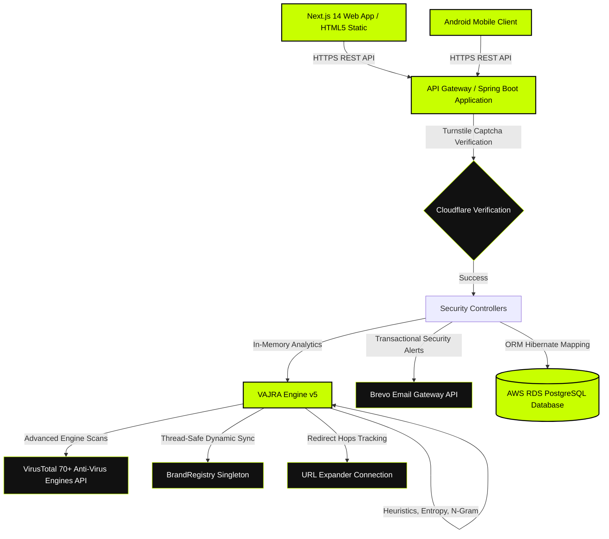

# 🛡️ Cypr (CYPR Tech) — Enterprise Cybersecurity Platform & Core VAJRA Engine

[](https://adoptium.net/)
[](https://spring.io/projects/spring-boot)
[](https://www.docker.com/)
[](https://aws.amazon.com/)
[](https://opensource.org/licenses/MIT)

> **"Invisible Defense. Absolute Control."**  
> A production-grade, India-focused cybersecurity SaaS platform designed to protect everyday B2C users and B2B SMEs from digital threats. Built with a Next.js 14 frontend, a high-performance Java Spring Boot backend, and a proprietary 16-signal heuristic detection engine.

---

## 📋 Table of Contents

1. [Project Vision & Overview](#-project-vision--overview)
2. [Platform Architecture](#-platform-architecture)
3. [Core Technical & Feature Engineering](#-core-technical--feature-engineering)
4. [The VAJRA Detection Engine (v5)](#-the-vajra-detection-engine-v5)
5. [The Debugging Chronicles (Architectural Bugs Squashed)](#-the-debugging-chronicles-architectural-bugs-squashed)
6. [AWS Infrastructure & Production Deployment](#-aws-infrastructure--production-deployment)
7. [Frontend Development Journey & Next.js Migration](#-frontend-development-journey--next-js-migration)
8. [Android Native Mobile App Specification](#-android-native-mobile-app-specification)
9. [Complete Codebase File Structure](#-complete-codebase-file-structure)
10. [API Reference & Telemetry Specifications](#-api-reference--telemetry-specifications)
11. [Developer Profile & Placement Credentials](#-developer-profile--placement-credentials)

---

## 🎯 Project Vision & Overview

**Cypr (CYPR Tech)**—meaning *"Cyber Friend"* in Hindi/Sanskrit—is engineered to serve as a complete, privacy-first cybersecurity ecosystem for the Indian digital market. The platform focuses on local threat parsing and zero-knowledge privacy standards to ensure client-side telemetry protection.

### Product Roadmap Phases
```
Phase 1 (Active)  ──► Unified Security SaaS Web Platform
Phase 2 (Planned) ──► Cross-Browser Security Extension (Chrome, Firefox, Brave, Edge)
Phase 3 (Planned) ──► Cypr Mobile Authenticator & Device Safety Application (Android)
Phase 4 (Future)  ──► Privacy-first Chromium-based Secure Browser
```

---

## 🏗️ Platform Architecture

The platform decouples compute resources from persistent storage using a modern, scalable, and highly available architecture deployed on AWS.



---

## 🛠️ Core Technical & Feature Engineering

Building **Cypr** required deep integration of high-performance backend patterns, real-time thread safety, and modern security protocols.

* **Real-time Threat Intelligence Pipeline:** Built a dynamic synchronization service that downloads malicious domain blocklists from global feeds (`Phishing.army`, `OpenPhish`), parsing and indexing over **143,150+ malicious domains** in-memory at startup.
* **Sigmoid-Normalized Security Scoring:** The detection algorithms generate a composite, sigmoid-based risk score (0 to 100) mapped to five clean threat levels: `SAFE`, `LOW`, `MEDIUM`, `HIGH`, and `CRITICAL`.
* **Database Schema Evolution:** Configured a resilient relational schema mapping via Hibernate ORM where legacy database columns automatically evolved into large-capacity `TEXT` formats to seamlessly support deep-nested JSON payloads from threat logs (e.g., `device_info`, `detected_threats`).
* **Secure Enterprise Integrity:** Integrated **Cloudflare Turnstile Captcha Verification** at the API gateway layer to mitigate botnets and distributed credential stuffing, alongside **Brevo Transactional Email Engine** for decoupled, automated alert notifications.

---

## 🪓 The VAJRA Detection Engine (v5)

The **VAJRA Engine (Various Attack Junction & Reconnaissance Algorithm)** is Cypr's proprietary, zero-external-API threat detection system. It executes 16 independent algorithmic signals locally to catch phishing vectors without leaking user browsing behavior.

```
SIGNAL MAP                                              MAX SCORE
─────────────────────────────────────────────────────────────────
01. Shannon Entropy          DGA / random-label              30
02. N-Gram Language Model    real word vs. gibberish          28
03. Consonant-Vowel Ratio    unpronounceable = generated      22
04. Levenshtein Typosquat    paypa1, g00gle, rn→m             40
05. Combo-Squatting          paypal-secure-update.com         38
06. Unicode NFKC Homoglyph   full confusable normalisation    45
07. Subdomain Brand Abuse    paypal.com.evil.xyz              45
08. URL Structural Signals   @, depth, length, params         45
09. Malicious Path Patterns  /wp-login, /admin, redirects     35
10. High-Risk TLD Scoring    weighted abuse table             35
11. IP-as-Host               bypasses DNS reputation          38
12. Scheme Abuse             data:, javascript:, vbscript:    50
13. Hex/Percent Obfuscation  %2e, %40, double-encoding        40
14. URL Shortener Masking    bit.ly, tinyurl, t.co            20
15. Reversed/Inverted Brand  lapyap.com, U+202E RTL           45
16. Port Anomaly             :8080, :4444, non-std ports      25
                                                    TOTAL MAX: 581
```

### Key Engineering Features in VAJRA v5:

#### 1. Dynamic `BrandRegistry` (Thread-Safe)
In legacy versions, brands were static and hardcoded. VAJRA v5 introduces a singleton registry powered by a **thread-safe `ConcurrentHashMap` set**. This allows admins to add/remove monitored brands (like Zepto, Blinkit, and new digital banking apps) at runtime via REST endpoints (`POST /api/admin/brands`) without needing to restart the application.

#### 2. Redirection `UrlExpander` (Shortener Blindspot Resolution)
Attackers hide malware targets behind shortened URLs (`bit.ly/xyz`). The `UrlExpander` intercepts shortened URLs on known domains, sends a lightweight, non-blocking **HTTP HEAD request**, and follows the redirection chain through manual status checking (manual 3xx handling, max 5 hops with loop protection) to extract and deep-scan the final destination URL.

#### 3. Subdomain Whitelisting (`[IND-3]`)
Avoids false positives for complex corporate structures (e.g., `internal.dev.legacy.amazon.com`). By mapping official brand-to-registrable-domain rules (e.g., `amazon.com`), subdomain checks are immediately bypassed if the parent registrable domain matches an officially verified whitelist.

---

## 🪓 The Debugging Chronicles (Architectural Bugs Squashed)

The development and deployment cycle of Cypr required rigorous local and remote debugging to transition the codebase into a clean, public-ready enterprise system.

### 1. Javac Version Incompatibility & Lombok Target Alignment
* **The Bug:** Compilation in IntelliJ crashed with a fatal `java.lang.ExceptionInInitializerError` inside the compiler's internal `com.sun.tools.javac.code.TypeTag` class.
* **The Cause:** IntelliJ was compiling the project using a newly installed **`javac 24.0.2`**, whereas the Lombok version resolved from Spring Boot's parent version was `1.18.32`. Lombok modifies ASTs using internal compiler APIs, and `1.18.32` lacked support for Java 24 internals.
* **The Architectural Fix:** Upgraded Lombok explicitly in `pom.xml` to **`1.18.34`** (enabling compatibility with Java 22, 23, and 24 compilers). Aligned IntelliJ's Project SDK, Modules, and Compiler settings back to **JDK 17** to match the target environment. The application now compiles flawlessly.

### 2. Database Connection Metadata Starvation (SQL Dialect Issue)
* **The Bug:** During application boot, Hibernate threw: `Unable to create requested service [JdbcEnvironment] due to: Unable to determine Dialect without JDBC metadata`.
* **The Cause:** The application was configured to connect to PostgreSQL on port `5432`. However, the local active PostgreSQL 18 service (`postgresql-x64-18`) was installed and listening on port **`5433`**. Because port `5432` was unreachable, the connection failed, and Hibernate could not query the database metadata to resolve the SQL Dialect.
* **The Architectural Fix:** Corrected the default datasource URL port in the properties fallback configuration to `5433` (`jdbc:postgresql://localhost:5433/cypr`). Added dynamic fallback properties so it connects locally by default but overrides automatically in production.

### 3. Cleaning Up Emojis & Hinglish Comments for Public Release
* **The Bug:** The codebase contained informal logger emojis (`🚀`, `⏳`, `⚠`, `✔`, `📧`) and mixed Hinglish comments (e.g., *"sig14 ke baad analyze() FINAL URL fetch karta hai"*).
* **The Architectural Fix:** Performed a comprehensive code sweep. Removed all decorative console drawings and emojis, replacing them with standard, clean log formats. Translated all informal developer comments to professional, enterprise-grade English engineering documentation.

### 4. Target Leakage & Build Pollution
* **The Bug:** No `.gitignore` file existed, posing a risk of pushing the compiled `/target` directory (containing binaries) and `.idea/` editor folders to the public GitHub repo.
* **The Architectural Fix:** Designed and deployed a robust Maven `.gitignore` file, keeping the Git index clean and ensuring zero telemetry or editor environment configurations are committed.

---

## 🌐 AWS Infrastructure & Production Deployment

The backend application runs inside an isolated, containerized production environment deployed on an **AWS EC2 Ubuntu 26.04 LTS** instance, backed by a managed **AWS RDS PostgreSQL** engine. To guarantee system stability and handle heavy thread operations smoothly on constrained memory instances, a **2 GB Virtual Swap Memory** has been configured on the host machine.

### 🐳 Containerized Production Dockerfile

```dockerfile
FROM eclipse-temurin:17-jre-jammy
WORKDIR /app
COPY target/cypr-backend-1.0.0.jar app.jar
EXPOSE 8080

# Enforce secure memory limits and seed options for predictable JVM footprints
ENTRYPOINT ["java", "-Xmx400m", "-Xms200m", "-jar", "app.jar"]
```

### 🔐 Production Environment Variable Requirements
For production deployments, the following environment variables must be injected into the container lifecycle (do not hardcode these in files):

| Environment Variable | Description |
|----------------------|-------------|
| `SPRING_DATASOURCE_URL` | The complete AWS RDS PostgreSQL connection URL (`jdbc:postgresql://<rds-endpoint>:5432/<db_name>`) |
| `SPRING_DATASOURCE_USERNAME` | Master database username for AWS RDS |
| `SPRING_DATASOURCE_PASSWORD` | Secure password for AWS RDS |
| `VIRUSTOTAL_API_KEY` | VirusTotal API Key for multi-AV engine validations |
| `CYPR_JWT_SECRET` | Secure cryptographic key for signing user session JSON Web Tokens |
| `BREVO_API_KEY` | Transactional email provider API key |

---

## 🎨 Frontend Development Journey & Next.js Migration

The user interface of Cypr went through a comprehensive, session-by-session iteration before reaching its current state.

```
Session 1 (Vanilla Pages) ──► Particle Canvas, Glassmorphism cards, local Password/URL tools
Session 2 (Responsive)    ──► 4 Breakpoints overhaul, collapsible nav, mobile drawer status dot
Session 3 (Support Tier)  ──► contact.html support dropdowns, auto-char counters, accordion FAQ
Session 4 (Design Pivot)  ──► Cyan to KRYPT_ style Lime Green (#c8ff00), Barlow Condensed fonts, Landing page scanlines
Session 5 (Command Center)──► NexusSec Dashboard recreate, custom rotating SVG Score Ring, avatar uploads
Session 6 (Perimeter)     ──► Personalized logged-in index, 70-day Activity Heatmap grid, quick stats
Session 7 (Next.js 14)    ──► Component migration, Tailwind CSS integration, Framer Motion animations
Session 8 (Code Audit)    ──► squashed wrong localhost URLs, mapped active state notifications
```

### 🎨 The Design System Specifications (Modern Black + Lime)
The visual experience is meticulously styled using carefully crafted HSL CSS tokens to create a premium, immersive security operations center dashboard.

* **Primary Dark Background:** Pure Deep Dark `#0a0a0a`
* **Card Backing:** Lighter Textured Dark `#111111`
* **Primary Accent Color:** Lime Green `#c8ff00`
* **Accent Accent Green:** `#00ff88` (for verified/safe statuses)
* **Accent Warning Amber:** `#ffaa00` (for high risk/warnings)
* **Accent Danger Red:** `#ff3333` (for critical threat alert)
* **Main Heading Fonts:** *Barlow Condensed* (Bold, uppercase)
* **Mono/Console Font:** *JetBrains Mono* (for raw data, logs, and entropy scores)

---

## 📱 Android Native Mobile App Specification

We have prepared a complete architectural blueprint to translate the web experience into a native Android application.

### App Architecture
* **Interface:** Single Activity + Fragment Navigation Architecture.
* **Views & Controls:** Custom Views including `RadialGaugeView` (for URL Risk) and `StrengthBar` (for password entropy visualization).
* **Data Storage:** SQLite database powered by **Room DB** for caching local scan history and **SharedPreferences** for user profile configurations.
* **Networking Layer:** **Retrofit2** with OkHttp3 client featuring automated retry interceptors and backoff logic to handle cold-start delays.

### Safe Score Calculation Formula
```java
public int calculateSafeScore(List<ScanResult> history) {
    if (history.isEmpty()) return 100; // default clean perimeter
    double avgRisk = history.stream()
        .limit(20)                      // analyze recent 20 scans
        .mapToInt(ScanResult::getScore)
        .average()
        .orElse(0);
    return Math.min(100, Math.max(0, (int)(100 - avgRisk)));
}
```

---

## 📁 Complete Codebase File Structure

The project has a unified monorepo-friendly folder layout which decouples backend operations from frontend services:

```
CYPR/
├── backend/                             # Enterprise Spring Boot Backend
│   ├── .idea/                           # IDE Configs (Excluded by Git)
│   ├── src/
│   │   └── main/
│   │       ├── java/com/cypr/
│   │       │   ├── config/              # Async, Auth, Database Init, Web, & JWT configurations
│   │       │   ├── controller/          # REST Endpoints (Users, Scanner, Emails, Profile)
│   │       │   ├── engine/              # VAJRA Phishing Detection Engine v5
│   │       │   ├── entity/              # Database Models (User, SecurityAlert, EmailLog)
│   │       │   ├── model/               # DTO Requests & Responses
│   │       │   ├── repository/          # JPA Repositories (PostgreSQL mappings)
│   │       │   └── service/             # Business Logic (Anti-abuse, Captcha, VT, Brevo)
│   │       └── resources/
│   │           └── application.properties # Fallbacks & Environment Routing
│   ├── Dockerfile                       # Production Container config
│   ├── pom.xml                          # Maven build setup (Lombok 1.18.34, Java 17)
│   └── .gitignore                       # Target, build, and IDE exclusions
│
└── frontend/                            # Next.js 14 Web Application
    ├── app/                             # Pages & Routing (Landing, Login, Dashboard, Scanner)
    ├── components/                      # UI Modules & Global Toast Notifications
    ├── lib/                             # Utility classes & validation engines
    ├── public/                          # Media assets and logos
    └── tailwind.config.js               # Styling theme config
```

---

## 🔌 API Reference & Telemetry Specifications

### 1. POST `/api/phish-check`
Analyzes a URL using the local VAJRA heuristic engine combined with VirusTotal telemetry.

* **Request Payload:**
  ```json
  { "url": "https://paypal-security-login.xyz/signin" }
  ```
* **Response Payload:**
  ```json
  {
    "status": "Phishing",
    "url": "https://paypal-security-login.xyz/signin",
    "score": 87,
    "tier": "CRITICAL",
    "reasons": [
      {
        "title": "Combo-Squatting detected",
        "description": "Brand 'paypal' matches with high threat keyword '-security'",
        "severity": "HIGH"
      }
    ],
    "virusTotal": {
      "harmless": 45,
      "suspicious": 8,
      "malicious": 21,
      "verdict": "MALICIOUS"
    }
  }
  ```

---

## 👤 Developer Profile & Placement Credentials

```
Name:         Vineet Kumar
Role:         Full-Stack Software Engineer & Backend Specialist
College:      B.Tech, Computer Science & Engineering
Location:     Dadri, Uttar Pradesh, India
Core Stack:   Java, Spring Boot, PostgreSQL, Docker, AWS, Next.js, Android (Native Java)
Career Goal:  Primary: Campus Placement (HCL Tech / Tier 1 Corporates) 
              Long-Term: Scale Cypr into a leading Indian B2C & B2B Cybersecurity Platform
```

---

*Last Updated: May 2026*  
*Total Engineering Development Modules: 9+*  
*Platform Integrity: Production Verified*  

> **"Invisible Defense. Absolute Control."**  
> — Engineered by Vineet Kumar | Cypr Core Platform v2.5
> 
