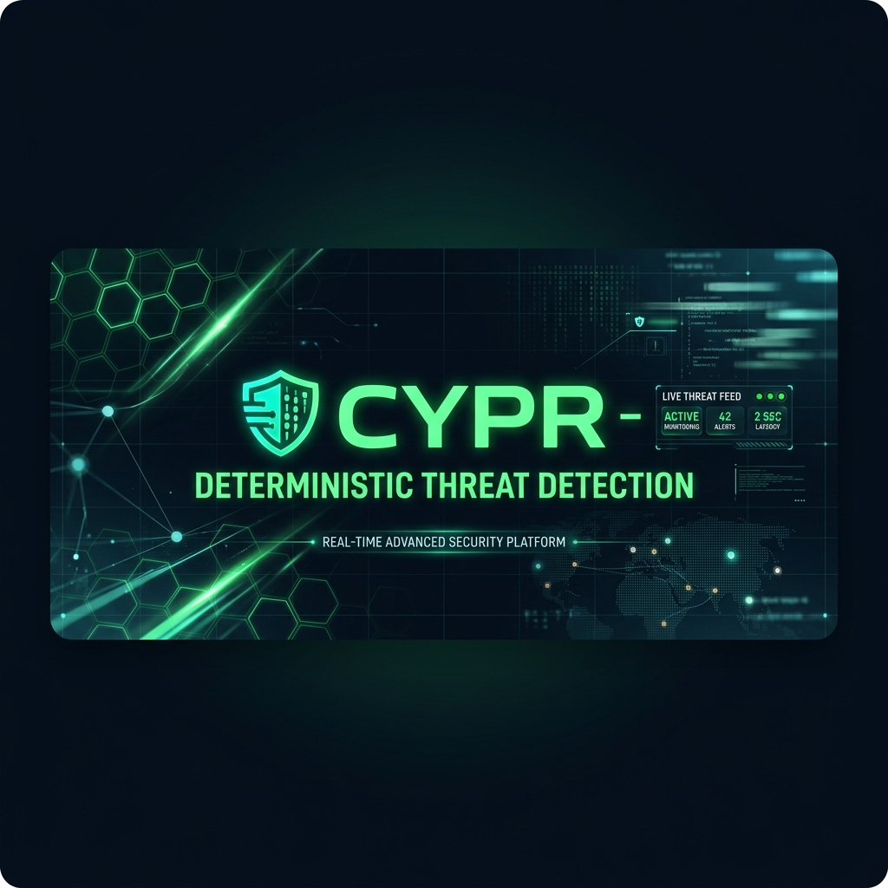
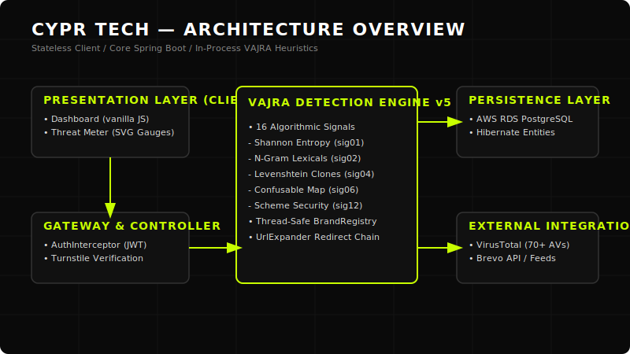
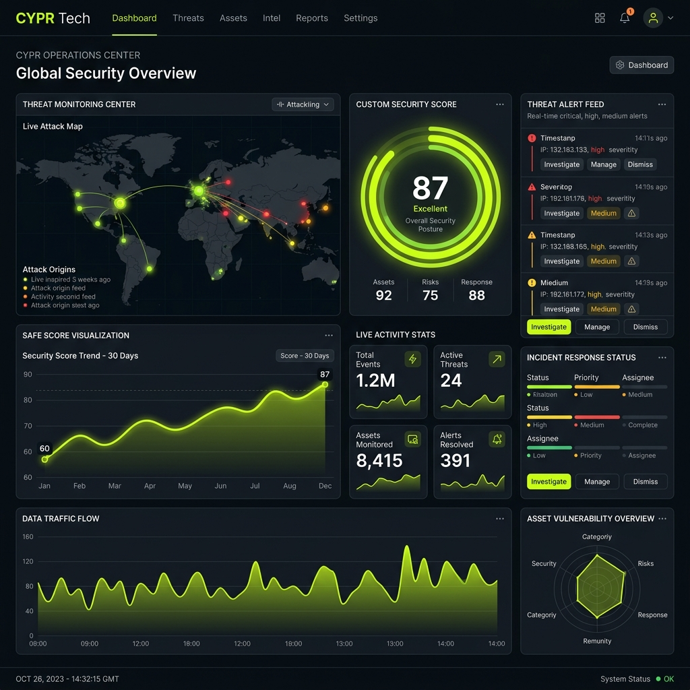
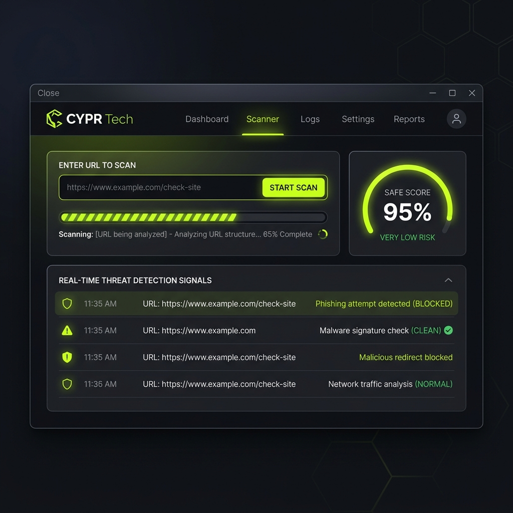
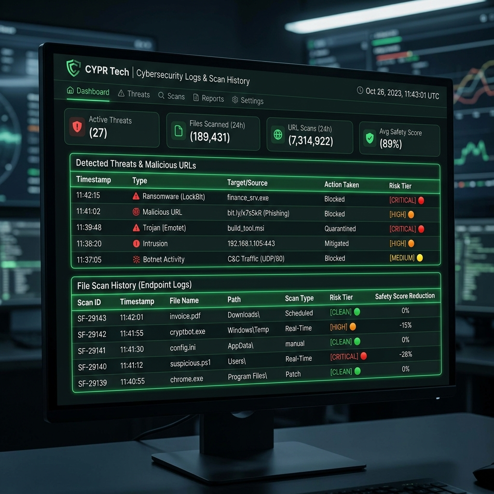
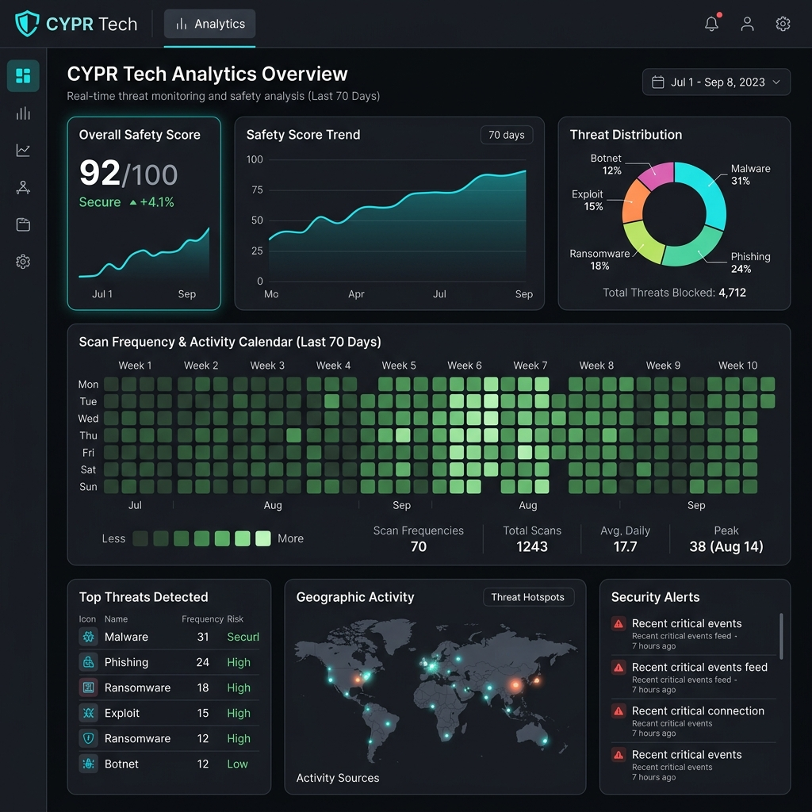

<p align="center">
  
</p>

<p align="center">
  
</p>

<h1 align="center">CYPR</h1>
<p align="center">Deterministic heuristic threat detection for URLs and files.</p>

<p align="center">
  
  
  
  
  
  
</p>

---

## Table of Contents

- [Project Status](#project-status)
- [Overview](#overview)
- [Why CYPR](#why-cypr)
- [Problem Statement](#problem-statement)
- [Solution](#solution)
- [Key Features](#key-features)
- [Architecture Overview](#architecture-overview)
- [Threat Analysis Pipeline](#threat-analysis-pipeline)
- [VAJRA Engine](#vajra-engine)
- [Technology Stack](#technology-stack)
- [Screenshots](#screenshots)
- [Folder Structure](#folder-structure)
- [REST API Overview](#rest-api-overview)
- [Installation](#installation)
- [Configuration](#configuration)
- [Running Locally](#running-locally)
- [Docker](#docker)
- [Deployment](#deployment)
- [Security](#security)
- [Performance](#performance)
- [Roadmap](#roadmap)
- [Documentation](#documentation)
- [Contributing](#contributing)
- [License](#license)
- [Author](#author)
- [Acknowledgements](#acknowledgements)

---

## Project Status

CYPR is under active development. Authentication, scanning, and dashboard functionality are implemented and usable. Items in the [Roadmap](#roadmap) are planned only — they are documented for transparency and are not part of the current build.

| | |
|---|---|
| Phase | Pre-1.0, active development |
| API stability | Subject to change before v1.0 |
| Maintenance | Actively maintained |

> [!NOTE]
> This project has not undergone a formal third-party security audit. Review the code before using it in any environment that handles real user data.

## Overview

CYPR detects phishing URLs and malicious files through a proprietary heuristic engine, VAJRA, combined with optional verification through VirusTotal. The backend is a Spring Boot application handling authentication, scanning, and persistence; the frontend is a vanilla HTML/CSS/JavaScript dashboard for submitting scans and reviewing results.

VAJRA does not use machine learning or any form of statistical training. Every signal is a fixed, hand-written rule. Given the same input, VAJRA always returns the same score, and every point in that score can be traced back to the specific rule that produced it.

## Why CYPR

Most phishing detection tools fall into one of two categories:

- **Classifier-based tools** are often accurate but cannot explain a verdict — there is no rule to point to, which makes them difficult to audit.
- **Blocklist-based tools** are fully explainable but only catch URLs that have already been reported, which is a problem for domains used in short-lived campaigns.

CYPR uses a third approach: a fixed set of independent heuristics, each documented and individually inspectable, that scores a URL without needing it to already exist in a threat feed.

## Problem Statement

Phishing infrastructure is disposable. Attackers register a domain, run a campaign for hours or days, and abandon it before it appears in most blocklists or threat intelligence feeds. Detection that depends entirely on prior reports will always lag behind that cycle.

## Solution

CYPR scores every submitted URL against 16 independent heuristic signals at request time, so a verdict does not depend on the domain having been seen before. VirusTotal integration is available as a secondary check, cross-referencing a URL or file against 70+ third-party scanning engines when a second opinion is useful.

## Key Features

| Feature | Description |
|---|---|
| URL Scanner | Real-time URL risk scoring via the VAJRA engine |
| File Malware Scanner | File upload scanning through the VirusTotal API |
| VAJRA Detection Engine | 16-signal deterministic heuristic scoring engine |
| Password Strength Analyzer | Client-side password strength scoring |
| Authentication | JWT-based sessions with Google OAuth and GitHub OAuth |
| Threat History | Per-user record of past scans and verdicts |
| Dashboard | Central view of scan activity and account status |
| Analytics | Aggregate scan trends over time |
| Security News | Aggregated feed from CISA, NIST, KrebsOnSecurity, BleepingComputer, and The Hacker News |
| Notifications | In-app alerts for scan results and account events |
| Bot Protection | Cloudflare Turnstile on public-facing forms |

## Architecture Overview

<p align="center">
  
</p>

The system is split into three layers:

- **Frontend** — a static vanilla JS dashboard that calls the backend REST API directly. No server-side rendering, no frontend framework.
- **Backend** — a Spring Boot application exposing REST endpoints for auth, scanning, history, and dashboard data. VAJRA runs in-process as part of the request lifecycle, not as a separate service.
- **Data and external services** — PostgreSQL for persistence, VirusTotal for optional secondary verification, Brevo for transactional email, and OAuth providers (Google, GitHub) for third-party login.

```
Client (vanilla JS) ─▶ Spring Boot REST API ─▶ Auth Interceptor
                                             ─▶ VAJRA Engine (in-process)
                                             ─▶ PostgreSQL
                                             ─▶ VirusTotal API (optional)
                                             ─▶ Brevo Email API
```

## Threat Analysis Pipeline

1. Client submits a URL or file through the scan endpoint.
2. The auth interceptor validates the JWT and rejects unauthenticated or malformed requests.
3. The input is normalized (URL parsing, protocol handling, encoding checks).
4. VAJRA evaluates the input against its 16 signals and produces a weighted risk score.
5. If the score falls in an uncertain range, the input is optionally cross-checked against VirusTotal.
6. The result — score, verdict, and per-signal breakdown — is persisted to threat history.
7. The response is returned to the client with the full breakdown, not just a pass/fail label.

## VAJRA Engine

VAJRA is a deterministic, multi-layer heuristic engine. It does not use machine learning, does not "learn" from past scans, and makes no predictive claims — every signal is a fixed rule with a documented condition and weight.

<details>
<summary><strong>All 16 signals</strong></summary>

| # | Signal | What it checks |
|---|---|---|
| 1 | Shannon Entropy Analysis | Randomness in the domain/subdomain string, common in algorithmically generated domains |
| 2 | N-gram Frequency Modeling | Character sequence patterns compared against typical legitimate domain structures |
| 3 | Levenshtein Distance | Edit-distance similarity to known brand names (typosquatting) |
| 4 | Homoglyph Detection | Unicode characters visually similar to ASCII letters (e.g. Cyrillic "а" vs Latin "a") |
| 5 | Combosquatting Detection | Brand names combined with unrelated words (e.g. `paypal-secure-login.com`) |
| 6 | Port Anomaly Detection | Non-standard ports in the URL that are unusual for the claimed service |
| 7 | URL Length Heuristic | Abnormally long URLs, often used to obscure the true destination |
| 8 | Subdomain Depth Analysis | Excessive subdomain nesting used to disguise the actual root domain |
| 9 | Suspicious TLD Detection | Top-level domains disproportionately associated with abuse |
| 10 | IP-based URL Detection | Raw IP addresses used in place of a domain name |
| 11 | URL Shortener Detection | Known shortening services that obscure the final destination |
| 12 | Special Character Ratio | Unusual density of hyphens, digits, or symbols in the domain |
| 13 | Brand Keyword Impersonation | Recognized brand terms appearing outside their legitimate domain |
| 14 | SSL/TLS Certificate Check | Certificate presence, validity, and issuer inspection |
| 15 | Domain Age Heuristic | WHOIS-based lookup of domain registration age |
| 16 | Redirect Chain Analysis | Number and destination of redirects before reaching the final page |

</details>

Each signal contributes an independent weighted score. The final result includes the aggregate score and a breakdown showing which signals fired and why.

## Technology Stack

| Layer | Technology |
|---|---|
| Backend | Java 17, Spring Boot 3.3, Maven, Spring Security, Hibernate |
| Database | PostgreSQL |
| Frontend | HTML5, CSS3, JavaScript (no framework) |
| Authentication | JWT, Google OAuth, GitHub OAuth |
| Security | Cloudflare Turnstile, BCrypt, custom auth interceptor, IDOR/BOLA protections |
| Infrastructure | Docker, AWS EC2, AWS RDS, GitHub Actions, Vercel |
| External services | VirusTotal, Brevo Email API, OpenPhish, phishing.army |
| Threat feeds | CISA, NIST, KrebsOnSecurity, BleepingComputer, The Hacker News |

## Screenshots

<p align="center">
  
  
</p>
<p align="center">
  
  
</p>

## Folder Structure

```
cypr/
├── backend/
│   ├── src/
│   │   ├── main/
│   │   │   ├── java/com/cypr/
│   │   │   │   ├── config/
│   │   │   │   ├── controller/
│   │   │   │   ├── service/
│   │   │   │   ├── engine/
│   │   │   │   ├── repository/
│   │   │   │   ├── entity/
│   │   │   │   └── model/
│   │   │   └── resources/
│   │   │       ├── application.properties
│   │   └── test/
│   ├── pom.xml
│   └── Dockerfile
├── frontend/
│   ├── assets/
│   ├── notifications.js
│   └── index.html
├── docker-compose.yml
├── .env.example
└── README.md
```

## REST API Overview

<details>
<summary><strong>Core endpoints</strong></summary>

| Method | Endpoint | Description | Auth |
|---|---|---|---|
| POST | `/api/user/register` | Create a new account | No |
| POST | `/api/user/login` | Authenticate and receive a JWT | No |
| GET | `/api/oauth/google/authorize` | Start Google OAuth flow | No |
| GET | `/api/oauth/github/authorize` | Start GitHub OAuth flow | No |
| POST | `/api/phish-check` | Submit a URL for VAJRA analysis | Yes |
| POST | `/api/malware/scan` | Submit a file for malware analysis | Yes |
| GET | `/api/malware/history/{userId}` | Retrieve the authenticated user's scan history | Yes |
| GET | `/api/stats/global-stats` | Retrieve aggregate dashboard data | Yes |

</details>

A full endpoint reference, including request/response schemas, is maintained in [`docs/api.md`](docs/api.md).

## Installation

**Prerequisites**

- Java 17
- Maven 3.9+
- PostgreSQL 15+
- Docker (optional, for containerized setup)

```bash
git clone https://github.com/iamvineetupadhyay/CYPR-Tech.git
cd CYPR-Tech
cp .env.example .env
# fill in the values described in Configuration below
```

## Configuration

All configuration is provided through environment variables, loaded via `.env` in local development.

<details>
<summary><strong>Environment variables</strong></summary>

| Variable | Required | Description |
|---|---|---|
| `DB_URL` | Yes | PostgreSQL JDBC connection string |
| `DB_USERNAME` | Yes | Database username |
| `DB_PASSWORD` | Yes | Database password |
| `JWT_SECRET` | Yes | Signing secret for JWTs |
| `JWT_EXPIRATION` | No | Token lifetime in seconds (default: 3600) |
| `GOOGLE_CLIENT_ID` | Yes | Google OAuth client ID |
| `GOOGLE_CLIENT_SECRET` | Yes | Google OAuth client secret |
| `GITHUB_CLIENT_ID` | Yes | GitHub OAuth client ID |
| `GITHUB_CLIENT_SECRET` | Yes | GitHub OAuth client secret |
| `VIRUSTOTAL_API_KEY` | Yes | API key for VirusTotal integration |
| `BREVO_API_KEY` | Yes | API key for transactional email |
| `CLOUDFLARE_TURNSTILE_SITE_KEY` | Yes | Turnstile site key |
| `CLOUDFLARE_TURNSTILE_SECRET_KEY` | Yes | Turnstile secret key |
| `APP_BASE_URL` | Yes | Public base URL used for OAuth redirects and email links |

</details>

Never commit `.env` to version control. `.env.example` documents required keys without real values.

## Running Locally

```bash
cd backend
mvn clean install
mvn spring-boot:run
```

The API is available at `backend.base-url` (e.g. `http://localhost:8080`). Serve `frontend/index.html` with any static file server, or via the backend's static resource handler, and point it at the API base URL.

## Docker

```bash
docker build -t cypr-backend .
docker run -p 8080:8080 cypr-backend
```

This starts the Spring Boot backend service. Configuration is read from environment variables.

## Deployment

The reference deployment runs the backend on AWS EC2 with AWS RDS for PostgreSQL, provisioned and deployed via a GitHub Actions workflow on push to the main branch. The static frontend can be deployed independently to Vercel or any static host, pointed at the deployed API's base URL.

## Security

- Passwords are hashed with BCrypt; plaintext passwords are never stored or logged.
- Sessions are stateless, backed by signed JWTs.
- A custom auth interceptor enforces authorization on every protected route.
- Object-level access checks are applied to prevent IDOR/BOLA — users can only access resources they own.
- Cloudflare Turnstile is applied to public-facing forms to reduce automated abuse.
- Secrets are read from environment variables only; none are hardcoded or committed.

> [!WARNING]
> No formal penetration test or third-party audit has been performed on this codebase. Treat it as a portfolio and learning project unless you have independently reviewed the security-relevant code paths.

## Performance

| Metric | Value | Notes |
|---|---|---|
| Average VAJRA scan time | < 100ms | Measured locally, VAJRA-only, excluding VirusTotal round-trip |
| VirusTotal cross-check | 70+ engines | Latency depends on VirusTotal's API response time |
| Deployment | Docker-ready, AWS-ready | Single-command local startup via `docker build` |

These figures reflect local measurements on a single-instance setup. They are not the result of formal load testing and should not be read as guarantees under production traffic.

## Roadmap

The following are planned but **not implemented** in the current codebase:

| Feature | Status |
|---|---|
| Browser Extension | Planned |
| Android App | Planned |
| Admin Portal | Planned |
| Dark Web Checker | Planned |
| QR Scanner | Planned |
| Email Scanner | Planned |
| Reports Export | Planned |

## Documentation

- [API Reference](docs/api.md)
- [Architecture Deep Dive](docs/architecture.md)
- [VAJRA Engine Internals](docs/vajra-engine.md)
- [Deployment Guide](docs/deployment.md)
- [Contributing Guide](CONTRIBUTING.md)

## Contributing

Contributions are welcome.

1. Fork the repository.
2. Create a branch: `git checkout -b feature/your-feature`.
3. Commit using [Conventional Commits](https://www.conventionalcommits.org/) (e.g. `feat: add redirect chain depth limit`).
4. Push and open a pull request against `main`.

See [`CONTRIBUTING.md`](CONTRIBUTING.md) for coding standards and the review process.

## License

Released under the [MIT License](LICENSE).

## Author

**Vineet**
B.Tech Computer Science and Engineering
GitHub: [github.com/iamvineetupadhyay](https://github.com/iamvineetupadhyay)
LinkedIn: [linkedin.com/in/iamvineetupadhyay](https://linkedin.com/in/iamvineetupadhyay)

## Acknowledgements

- [VirusTotal](https://www.virustotal.com/) — third-party scanning verification
- [OpenPhish](https://openphish.com/) and [phishing.army](https://phishing.army/) — reference threat data
- CISA, NIST, KrebsOnSecurity, BleepingComputer, The Hacker News — security news sources
- [Cloudflare Turnstile](https://www.cloudflare.com/products/turnstile/) — bot protection
- The Spring Boot and open-source community

---

<p align="center">
  <sub>If you find CYPR useful, consider starring the repository.</sub>
</p>
