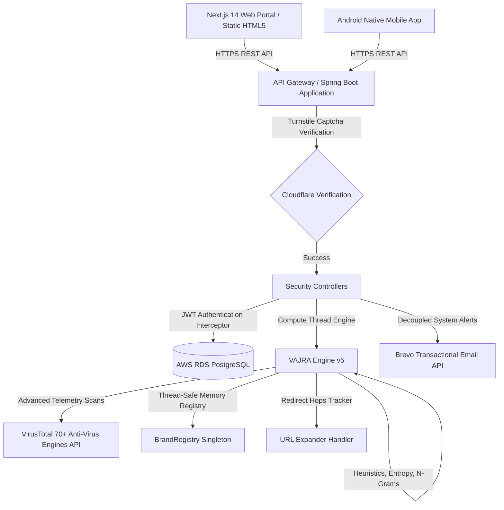

# System Architecture — CYPR Tech

This document describes the high-level system architecture, component layers, and data flow of the CYPR Tech cybersecurity platform.

## High-Level Diagram

## Component Layers

### 1. Presentation Layer (Client)
- **Web App**: Built with Next.js 14 & Tailwind CSS, offering an interactive Security Operations Center (SOC) dashboard.
- **Mobile App**: Native Android application utilizing Room DB for local caching and Retrofit2/OkHttp3 client telemetry.

### 2. Gateway & Security Layer
- **Cloudflare Turnstile**: Embedded on register/login forms to prevent bot ingress and credential stuffing.
- **JWT Interceptor**: Validates token payloads on incoming REST calls, protecting sensitive user data and credentials.
- **Rate Limiting**: Enforces strict origin-based rate limiting to prevent denial-of-service vectors.

### 3. Core Compute Layer (VAJRA Engine v5)
- Executes 16 independent algorithmic signals locally.
- Computes Shannon entropy, consonant-vowel ratio, Punycode homoglyphs, and Levenshtein typosquatting scores.
- Utilizes an in-memory database of **143,150+ malicious domains** loaded at startup for sub-millisecond lookup latency.

### 4. Integration & Orchestration Layer
- **VirusTotal API**: Performs asynchronous multi-AV verification across 70+ security engines as an optional secondary validation block.
- **Brevo API**: Dispatches transactional alert emails, verification links, and password recovery tokens.

### 5. Persistence Layer
- **AWS RDS PostgreSQL**: Production database cluster mapping object states via Hibernate ORM.
- **Local Cache**: LocalStorage (Web) and Room SQLite (Android) cache telemetry histories.
